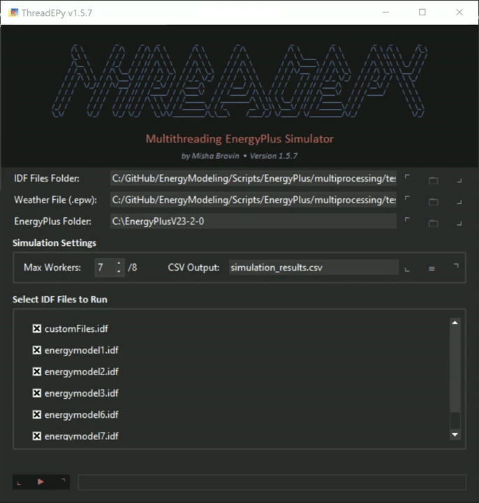
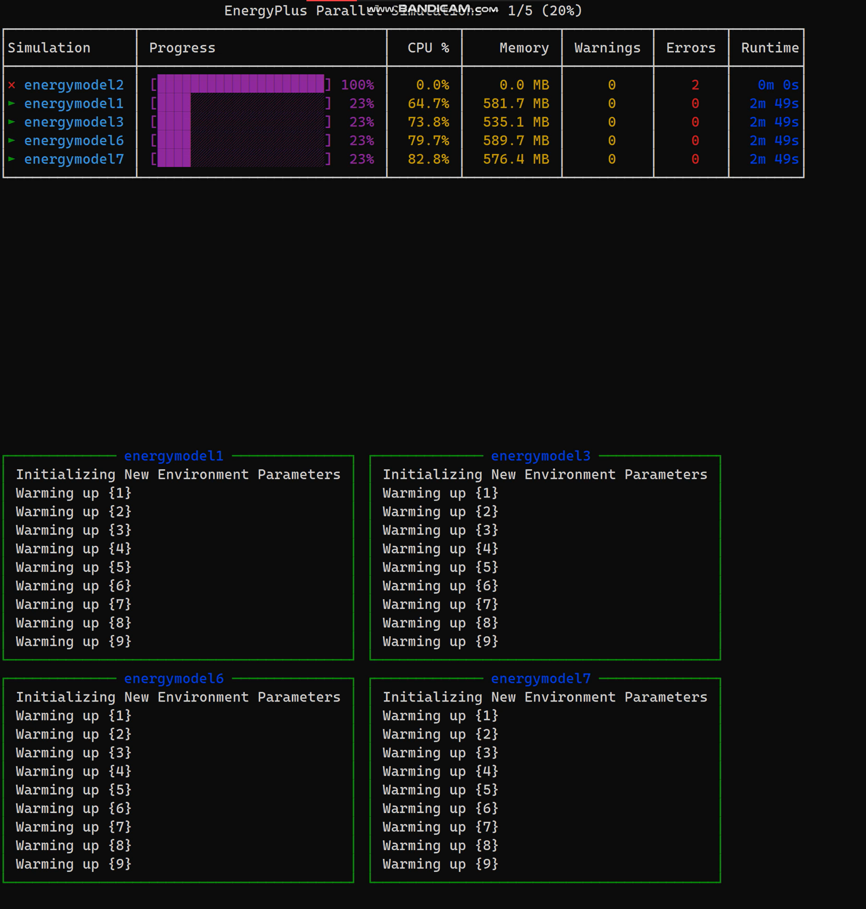
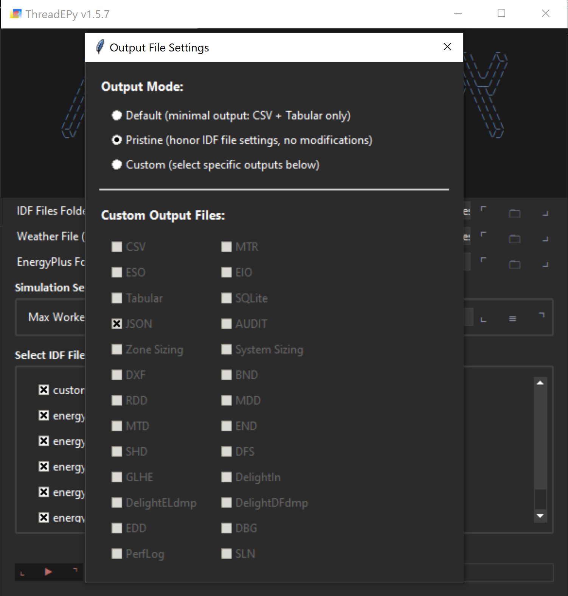

# ThreadEPy
## Embarrassingly Parallel EnergyPlus Python Simulator

A Python utility for running multiple EnergyPlus simulations concurrently with real-time monitoring and progress tracking.

## Overview

ThreadEPy automates the execution of multiple EnergyPlus simulations in parallel, efficiently utilizing all available CPU cores. The tool features both a graphical interface and a terminal-based UI to monitor progress, resource usage, and simulation status in real-time.

### Interactive GUI Preview

<div align="center">

</div>

### Simulation Dashboard

<div align="center">

</div>

## Features

- **Parallel Processing**: Automatically detects available CPU cores and runs multiple simulations concurrently
- **Real-time Monitoring**: Live UI showing simulation progress, CPU and memory usage
- **Automatic Staging**: Queues simulations and starts new ones as others complete
- **Error Handling**: Detects and reports simulation failures in real-time
- **CSV Reporting**: Generates a detailed CSV report of all simulation runs
- **Resource Management**: Monitors and displays CPU and memory usage for each simulation

<div align="center">

</div>

## Installation

### Prerequisites

- Python 3.8 or higher
- Tested on EnergyPlus 23.2.0 (must be installed separately)

### Setup

1. Clone this repository:
   ```bash
   git clone https://github.com/skibadubskiybadubs/ThreadEPy.git
   cd ThreadEPy
   ```

2. Install the required dependencies:
   ```bash
   pip install rich psutil
   ```

## Usage

1. Place your IDF files and weather file (EPW) in the same directory as the script.

2. Run the script:

   There are several ways to run the script. You can enable the built-in GUI by simply calling the script without any additional arguments:
   ```bash
   python eP_P.py
   ```

   Otherwise, you can skip the built-in GUI to immediately run the script. In this case, all the .idf and .epw files must be located in the root folder along with the script:
   ```bash
   python eP_P.py --eplus "C:\EnergyPlusV23-2-0"
   ```

### Command-line Arguments

- `--eplus`: Path to the EnergyPlus installation directory (required)
- `--max-workers`: Maximum number of parallel simulations (default: number of logical processors - 1)
- `--csv`: Output CSV file name (default: "simulation_results.csv")

### Example

```bash
python eP_P.py --eplus "C:\EnergyPlusV23-2-0" --max-workers 6 --csv "results.csv"
```

## How It Works

1. The script automatically finds all IDF files in the current directory.
2. It determines the optimal number of parallel simulations based on your computer's specifications.
3. It creates temporary directories for each simulation to prevent conflicts.
4. Simulations run in parallel, with new ones starting as others complete.
5. The script provides live monitoring of all running simulations.
6. Upon completion, a summary CSV file is generated with detailed results.

## CSV Output Format

The script generates a CSV file with the following columns:

| Column | Description |
|--------|-------------|
| # | Row ID |
| Job_ID | Simulation name (IDF filename without extension) |
| WeatherFile | Weather file used |
| ModelFile | IDF filename |
| Progress | 1 (Completed) or 0 (Failed) |
| Message | Success or failure message |
| Warnings | Number of warnings |
| Errors | Number of errors |
| Hours | Runtime hours |
| Minutes | Runtime minutes |
| Seconds | Runtime seconds |

## Troubleshooting

### Common Issues

1. **Error: EnergyPlus executable not found**
   - Ensure the path to EnergyPlus is correct
   - Verify EnergyPlus is properly installed

2. **Simulations start but fail immediately**
   - Check that your IDF files are valid
   - Verify that the weather file is in the same directory

3. **Script crashes with memory errors**
   - Reduce the number of parallel simulations using the `--max-workers` option

## License

This project is licensed under the MIT License - see the LICENSE file for details.

## Acknowledgements

- The Rich library for the terminal UI
- EnergyPlus for building energy modeling

## References
- https://unmethours.com/question/38548/simultaneously-run-a-number-of-independent-energyplus-simulations-on-multiple-cores-on-linux-via-a-script/
- https://bigladdersoftware.com/epx/docs/8-4/tips-and-tricks-using-energyplus/run-energyplus-in-parallel.html
- https://unmethours.com/question/4668/script-for-multiple-simulations/
- https://unmethours.com/question/31609/how-to-run-energyplus-in-multi-core-clusterlinux/
- https://github.com/santoshphilip/eppy/blob/55410ff7c11722f35bc4331ff5e00a0b86f787e1/eppy/runner/run_functions.py#L141
